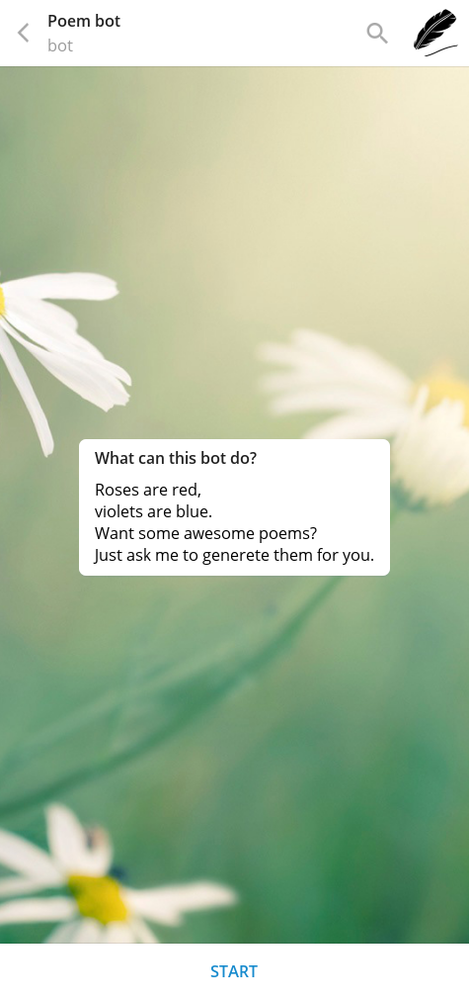
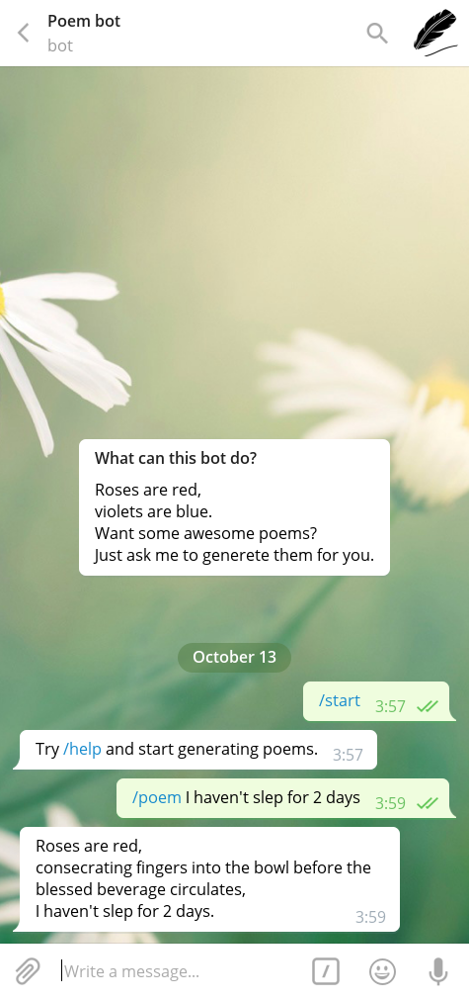
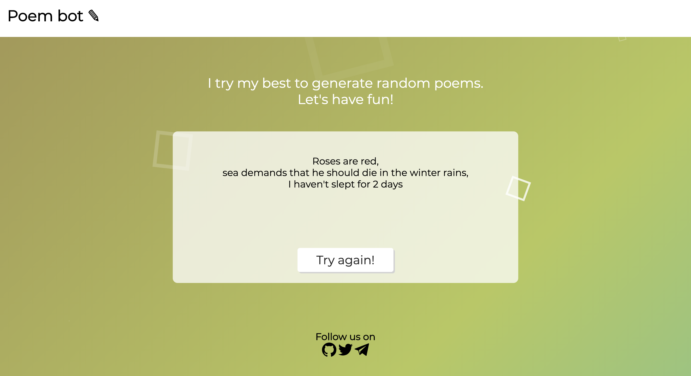
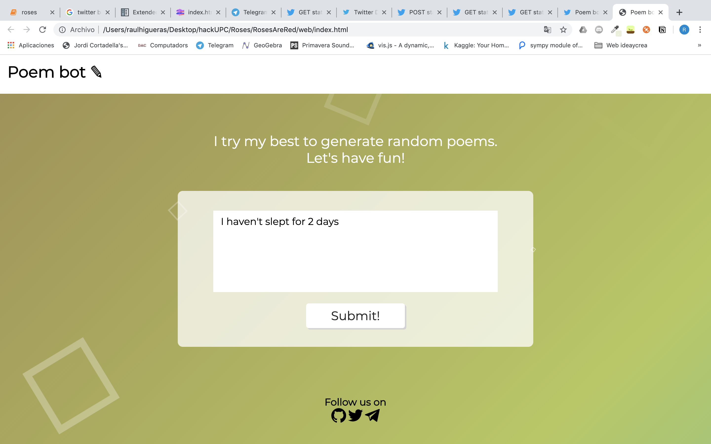
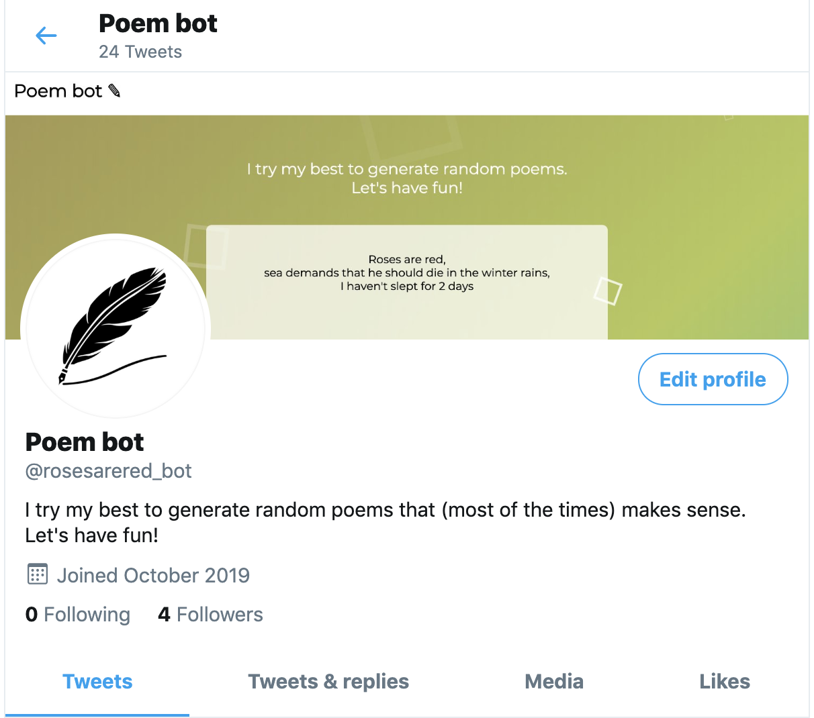

Do you like memes? Of course, you do. Have a little fun with Poem bot, built in [HackUPC'19](https://hackupc.com/).

## Contents

1. [Summary](#Summary)
    1. [Inspiration](#inspiration)
    2. [What it does](#what-it-does)
    3. [How we built it](#how-we-built-it)
    4. [Challenges we ran into](#challenges-we-ran-into)
    5. [Accomplishments that we're proud of](#accomplishments-that-were-proud-of)
    6. [What's next for Poem bot](#whats-next-for-git-inspect)
2. [Screenshots](#screenshots)
3. [Requirements](#requirements)
4. [Usage](#usage)
5. [Authors](#authors)
6. [License](#license)

## Summary

### Inspiration

Roses are red, violets are blue. We wrote a poem and now you can too!
We love memes. Who doesn't love memes?
So that's basically it. We wanted to give a little boost to a classic meme format. As fellow hackers we wanted to create this with our own hands just for fun.

### What it does

With only an input message, our API is able to generate the whole 'Roses are red, ...' poem structure. We can do that in various different platforms: web-app, [Telegram](https://web.telegram.org) bot and [Twitter](https://twitter.com) bot. The response in each platform is different but the end result is the same, an awesome poem.

We created from scratch a data set with words that we took from books like 'Moby Dick', 'The call of the wild', 'The Wizard of Oz' and 'The jungle book' (all books without Copyright). In this data set we stored a lead word memory so that we could generate sentient sentences from that.

### How did we built

Front-end and back-end are connected by API requests.

On one hand, for the front-end we created a web-app, a [Telegram](https://web.telegram.org) and a [Twitter](https://twitter.com) bot, an API, and we are planning on launching a [Reddit](https://www.reddit.com/) bot. For the web-app we used [CSS](https://www.w3.org/Style/CSS/), [JavaScript](https://developer.mozilla.org/es/docs/Web/JavaScript) and [HTML](https://html.spec.whatwg.org/multipage/). For both bots we used [Python](https://www.python.org/), [telegram](https://github.com/python-telegram-bot/python-telegram-bot) and [tweepy](https://www.tweepy.org/) are the libraries that we used for the project.

On the other hand, for the back-end we had to design, create and develop the stochastic process that is behind our sentence generator so that it could make up grammatically correct sentences and also taking into account a given rhyme word. Also, we wanted to provide a set of interfaces so that the way to access the generator was both easy to use from the users sight and from the developers sights.

### Challenges we ran into

First of all, dealing with human language structure was our fist challenge. Simulating this structures with a mathematical model was for sure a difficult task, but we ended up creating a Markov Chain. So with a probabilistic approach to the problem, lead us to the solution we were looking for.

Our main goal was to create a Twitter bot, but we found out that we couldn't access to their APIs without a developer account, so we ask for one and... Luckily or not, the application was approved Saturday night.

Since we needed to use .txt files, we had to 'clean' them in order to process them word by word. That means, subtracting all punctuation signs, capital letters, numbers and all sort of weird characters that we couldn't read, but taking into account sentence endings and beginnings so that our data set was the most accurate possible.

Also, we wanted to develop an eye-catching interface for the web-app using Glitch, a new workspace for us.

### Accomplishments that we are proud of

We are really proud of the final project because it exceeded our expectations. Use were able to implement a Markov Chain, something that we learned a few weeks ago in Probability&Statictics class, we are also proud of making our own API (no AI libraries were needed). Our goal was to build something cool and learn new skills with it. We were able to accomplish our main goal, the Twitter bot. Also, we are very proud of our web-app interface and how we were able to build something this nice looking.

### What's next for Roses Are Red bot

We want to expand our project to even more platforms like Reddit. We think that our sentence generator API is easily scalable.

## Screenshots

This is how our project looks like unifying front-end and back-end.

## Authors

- [Raúl Higueras](https://github.com/raulhigueras)
- [Pau Lozano](https://github.com/driux)
- [Marina Rosell](https://github.com/marinarosell)
- [Yinlena Xu](https://github.com/lenadoufu)
